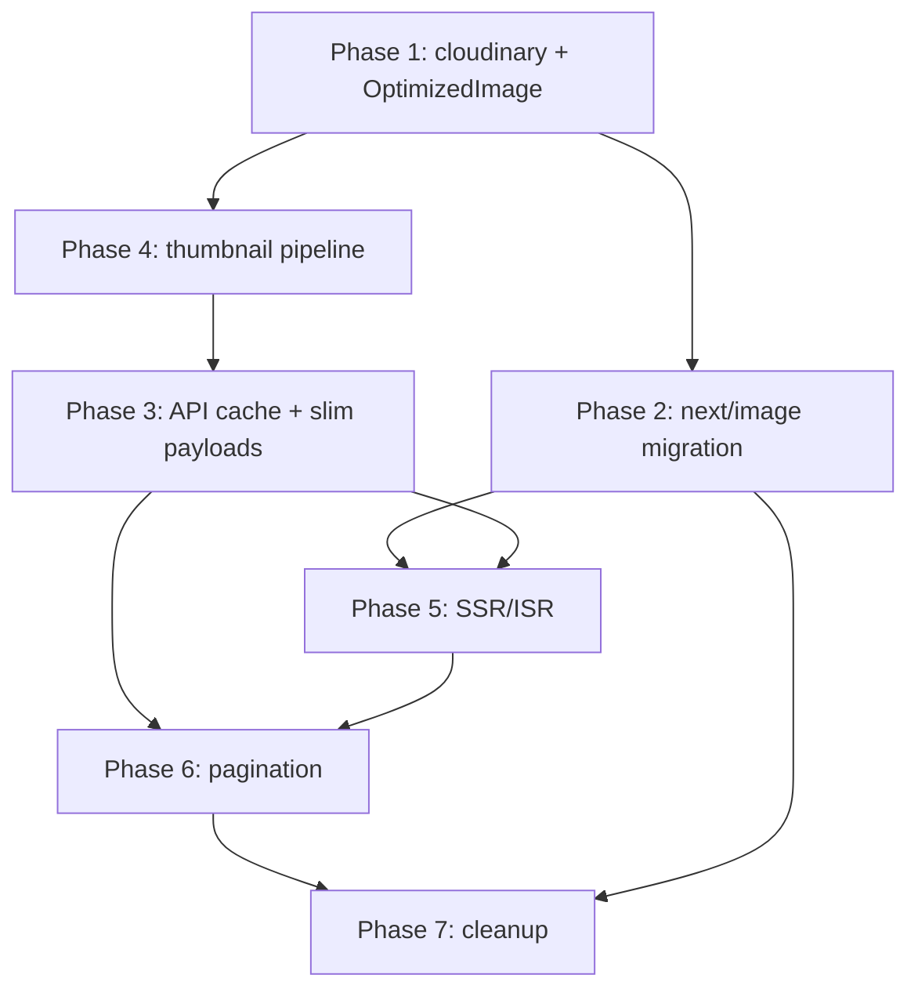

# Image Loading Optimization Plan

> Version: 1.0  
> Status: Planning  
> Created: 2026-07-21  
> Related: [app-overview-for-feedback.md](./app-overview-for-feedback.md), [vision-and-roadmap.md](./vision-and-roadmap.md)

---

## Summary

Audit of the jojjy-gallery-app codebase found that image loading is slow
because most pages load **full-resolution Cloudinary URLs** via raw ``
tags, bypassing Next.js Image Optimization. Portfolio pages use `next/image`
correctly; archive (`/gallery`), shop, events, and artwork detail pages do
not.

This document is the implementation plan to address all identified
optimizations in phased, shippable PRs.

**Estimated effort:** 2–3 weeks (one developer), or 1–1.5 weeks for Phases
1–3 (~80% of the gain).

---

## Goals & Success Metrics

| Metric | Current (estimated) | Target |
|--------|---------------------|--------|
| Gallery LCP | Full-res JPG via ``, client waterfall | < 2.5s on 4G |
| Shop grid image payload | Full originals (~2–5 MB each) | < 200 KB per tile (WebP, sized) |
| Portfolio hero | CSS background, full URL | `next/image` + `priority`, WebP/AVIF |
| Archive API payload (`limit=100`) | All entries + nested `mediaFiles` | List payload < 50 KB |
| Repeat visit API calls | No cache headers | CDN/browser cache hit on static data |

**Verification tools:** Lighthouse (mobile), Network tab (image sizes/formats),
Vercel Analytics Web Vitals.

---

## Root Cause (Audit Findings)

### What works today

- Portfolio grid and series pages use `next/image` with `sizes` and blur
  placeholders (`pages/portfolio/index.tsx`, `pages/portfolio/[seriesName]/index.tsx`)
- Cloudinary domain is allowlisted in `next.config.ts`
- WebP/AVIF formats configured — but only apply to `next/image`

### What is slow

| Page | Problem | Severity |
|------|---------|----------|
| `/gallery` | Fetches 100 entries + all `mediaFiles`, renders every hero via `` | Critical |
| `/gallery/[id]` | Loads every photo in a series at full width via `` | Critical |
| `/shop` | Grid squares (~300px) load full artwork JPEGs | Critical |
| `/events` | Raw ``, full URLs | High |
| `/artworks/[id]` | 70–80vh detail view, unoptimized | High |
| `/portfolio` | Hero uses CSS `background-image` with full URL | Medium |
| Navbar / home logo | Raw `` on every navigation | Medium |

### Secondary bottlenecks

1. **API → image waterfall** — Image-heavy pages are client-rendered via SWR;
   images cannot start loading until JSON returns.
2. **`thumbnailUrl` unused effectively** — Schema supports it; seeds and list
   views use the same full-res URL as detail views.
3. **Over-fetching** — Portfolio uses `limit=all` + client `inGallery`
   filter; gallery pulls nested `mediaFiles` for list views.
4. **No API caching** — Public GET routes lack `Cache-Control` headers.
5. **No Cloudinary transform helper** — URLs stored and served as bare
   full-res JPGs (e.g. `prisma/seed.ts`).

### Key files

| Area | Files |
|------|-------|
| Config | `next.config.ts` |
| Gallery | `pages/gallery/index.tsx`, `pages/gallery/[id].tsx` |
| Shop | `pages/shop/index.tsx`, `pages/shop/[id].tsx` |
| Events | `pages/events/index.tsx`, `pages/events/[slug].tsx` |
| Artwork detail | `pages/artworks/[id].tsx` |
| Portfolio | `pages/portfolio/index.tsx`, `pages/portfolio/[seriesName]/index.tsx` |
| API | `pages/api/media-blog/index.ts`, `pages/api/artworks/index.ts`, `pages/api/events/index.ts` |
| Data hooks | `hooks/useArtWorks.ts` |
| Schema | `prisma/schema.prisma` (`thumbnailUrl`, `inGallery`) |
| Unused | `components/Art/ArtworkCard.tsx`, `components/Series/Section.tsx` |

---

## Architecture Decisions

Apply these before implementation begins.

### 1. Shared image utility — `lib/cloudinary.ts`

Central module for all URL transforms:

```ts
type ImagePreset = "thumb" | "card" | "hero" | "full";

const PRESETS: Record<ImagePreset, { w?: number; q?: string }> = {
  thumb:  { w: 400,  q: "auto" },
  card:   { w: 800,  q: "auto" },
  hero:   { w: 1600, q: "auto" },
  full:   { q: "auto" },
};

export function cloudinaryUrl(url: string, preset: ImagePreset = "full"): string;
export function pickImageUrl(
  primary: string | null,
  fallback?: string,
  preset?: ImagePreset
): string;
```

**Rule:** List/grid views always use `thumb` or `card`. Detail pages use
`hero` or `full`. Never pass raw DB URLs to `` or `next/image` without
going through this helper (except external non-Cloudinary URLs).

Example transform:

```
Original: .../upload/v123/foo.jpg
Thumb:    .../upload/f_auto,q_auto,w_400/v123/foo.jpg
```

### 2. Shared image component — `components/ui/OptimizedImage.tsx`

Wraps `next/image` with defaults:

- `placeholder="blur"` + shared blur SVG
- Sensible default `sizes` per preset
- `priority` prop for LCP candidates
- Passes URLs through `cloudinaryUrl()`

Avoids repeating `fill` / `sizes` / blur config across 15+ files.

### 3. API response shapes — list vs detail

| Endpoint | List fields | Detail fields |
|----------|-------------|---------------|
| `/api/media-blog` | `id`, `title`, `shortDesc`, `type`, `thumbnailUrl`, `createdAt` | + `content`, `mediaFiles[]` |
| `/api/artworks` | `id`, `title`, `imageUrl`, `price`, `status`, `medium`, `series` (minimal) | + `description`, `mediaFiles[]`, etc. |

Use `?include=minimal` on list requests. Detail routes keep full payloads.

---

## Phase 1 — Foundation (Day 1)

**Goal:** Shared infrastructure every later phase depends on.

| # | Task | Files |
|---|------|-------|
| 1.1 | Create `lib/cloudinary.ts` with preset transforms | New file |
| 1.2 | Create `components/ui/OptimizedImage.tsx` | New file |
| 1.3 | Add JSDoc examples for URL transforms | `lib/cloudinary.ts` |
| 1.4 | Export presets from a single place | `lib/cloudinary.ts` |

### Acceptance criteria

- [ ] `cloudinaryUrl(fullUrl, "thumb")` inserts `f_auto,q_auto,w_400` after `/upload/`
- [ ] Non-Cloudinary URLs pass through unchanged
- [ ] `OptimizedImage` renders with `fill` + preset `sizes`

---

## Phase 2 — Quick Wins: `next/image` Everywhere (Days 2–4)

**Goal:** ~70% of perceived speed improvement with minimal API changes.

### 2A — Gallery (`/gallery`, `/gallery/[id]`)

| File | Change |
|------|--------|
| `pages/gallery/index.tsx` | Replace 4× `` → `OptimizedImage`; preset `hero` for heroes, `card` for essay blocks; `priority` on opening hero |
| `pages/gallery/[id].tsx` | Replace all `` → `OptimizedImage`; `hero` for main content; `priority` on first image |
| `pages/gallery/index.tsx` | Use `pickImageUrl(entry.thumbnailUrl, images[0], "hero")` for hero URLs |

**Sizes guidance:**

- Opening hero: `sizes="(max-width: 768px) 100vw, 1600px"`
- List heroes: `sizes="(max-width: 768px) 100vw, 1400px"`
- Essay inline: `sizes="(max-width: 768px) 100vw, 900px"`

### 2B — Shop (`/shop`, `/shop/[id]`)

| File | Change |
|------|--------|
| `pages/shop/index.tsx` | `` → `OptimizedImage` preset `card`; `sizes="(max-width: 640px) 100vw, (max-width: 1024px) 50vw, 33vw"` |
| `pages/shop/[id].tsx` | Detail image preset `hero`; `priority` |

### 2C — Events (`/events`, `/events/[slug]`)

| File | Change |
|------|--------|
| `pages/events/index.tsx` | Grid → `OptimizedImage` preset `card` |
| `pages/events/[slug].tsx` | Hero + atmosphere grid → `OptimizedImage`; `priority` on hero |

### 2D — Artwork detail (`/artworks/[id]`)

| File | Change |
|------|--------|
| `pages/artworks/[id].tsx` | Main artwork → `OptimizedImage` preset `hero`; `priority` |

### 2E — Portfolio hero fix

| File | Change |
|------|--------|
| `pages/portfolio/index.tsx` | Replace CSS `backgroundImage` with `OptimizedImage fill priority sizes="100vw"` + overlay div for dark tint |

### 2F — Global chrome

| File | Change |
|------|--------|
| `components/ui/Navbar.tsx` | Logo → `OptimizedImage` fixed width/height |
| `pages/index.tsx` | Logo → `OptimizedImage` |
| `components/ui/CartDrawer.tsx` | Add `sizes="80px"` to existing `Image` |

### Acceptance criteria

- [ ] Zero raw `` for Cloudinary content (grep confirms)
- [ ] Network tab shows `.webp` or `.avif` from `/_next/image`
- [ ] Lighthouse LCP element is optimized image, not CSS background

---

## Phase 3 — API & Caching (Days 5–6)

**Goal:** Reduce JSON payload and repeat-visit latency.

### 3A — Cache headers helper

Create `lib/api-cache.ts`:

```ts
export function setPublicCacheHeaders(
  res,
  { sMaxAge = 60, swr = 300 } = {}
);
```

Apply to GET handlers:

| Route | Suggested cache |
|-------|-----------------|
| `/api/artworks` | `s-maxage=120, stale-while-revalidate=600` |
| `/api/media-blog` | `s-maxage=120, stale-while-revalidate=600` |
| `/api/events` | `s-maxage=300, stale-while-revalidate=900` |
| `/api/series` | `s-maxage=300, stale-while-revalidate=900` |

Skip cache on authenticated/mutating routes.

### 3B — Slim list payloads

| Route | Change |
|-------|--------|
| `pages/api/media-blog/index.ts` | Add `?include=minimal` — omit `mediaFiles`, omit `content` |
| `pages/api/artworks/index.ts` | Add `?include=minimal` — omit `mediaFiles`, `description` |
| `pages/gallery/index.tsx` | Fetch with `include=minimal&limit=100` |
| `pages/shop/index.tsx` | Fetch with `include=minimal` |

Detail routes (`[id].ts`, `[slug].ts`) keep full payloads.

### 3C — Server-side `inGallery` filter

| File | Change |
|------|--------|
| `pages/api/artworks/index.ts` | Add `inGallery` query param → `where.inGallery = true` |
| `types/api.ts` | Add `inGallery` to `ArtworkFilters` |
| `pages/portfolio/index.tsx` | Change to `useArtworks({ inGallery: true, include: "minimal" })`; remove client filter |

### Acceptance criteria

- [ ] Gallery list API response size drops significantly (no nested `mediaFiles`)
- [ ] Portfolio no longer fetches non-gallery artworks
- [ ] Response headers include `Cache-Control` on public GETs

---

## Phase 4 — Thumbnail Data Pipeline (Days 7–8)

**Goal:** DB stores meaningful thumbnail URLs, not duplicates of full-res.

### 4A — Seed & migration script

| File | Change |
|------|--------|
| `prisma/seed.ts` | Set thumbnail URLs via `cloudinaryUrl(imageUrl, "thumb")` at seed time |
| `prisma/seed-archive.ts` | Same for `MediaBlogEntry.thumbnailUrl` and `MediaBlogFile.thumbnailUrl` |
| `prisma/seed-events-shop.ts` | Same for event images |
| New: `scripts/backfill-thumbnails.ts` | One-time script: update rows where `thumbnailUrl IS NULL OR thumbnailUrl = url` |

### 4B — API serializers prefer thumbnails

| File | Change |
|------|--------|
| `types/api.ts` | In list converters, expose `displayImageUrl` = `thumbnailUrl ?? cloudinaryUrl(url, "card")` |
| Gallery index mapping | Use `displayImageUrl` instead of raw `mediaFiles[0].url` |

### 4C — CMS POST handlers (future-proof)

Auto-generate `thumbnailUrl` from main URL if not provided:

- `pages/api/media-blog/index.ts`
- `pages/api/media-blog/[id].ts`

### Acceptance criteria

- [ ] DB rows have distinct thumbnail URLs (transform-based is fine)
- [ ] List views never need full `mediaFiles` to show a preview

---

## Phase 5 — SSR / ISR (Days 9–11)

**Goal:** Eliminate client-side API → image waterfall on key pages.

### Strategy

Use **ISR** (`revalidate: 60–300`) for mostly-static gallery content. Keep
SWR for user-specific data only.

| Page | Approach |
|------|----------|
| `/gallery` | `getStaticProps` + ISR; pass minimal entries as props |
| `/gallery/[id]` | `getStaticPaths` (fallback: `'blocking'`) + ISR |
| `/shop` | `getStaticProps` + ISR |
| `/portfolio` | `getStaticProps` + ISR |
| `/events`, `/events/[slug]` | ISR |

### New shared data layer

Create `lib/data/` server-only fetchers (direct Prisma, no HTTP round-trip):

```
lib/data/artworks.ts       → getArtworks(filters), getArtwork(id)
lib/data/media-blog.ts     → getMediaBlogEntries(), getMediaBlogEntry(id)
lib/data/events.ts         → getEvents(), getEvent(slug)
```

Pages call these from `getStaticProps`. Existing API routes stay for client
mutations and admin.

### Preload LCP

Use `priority` on `OptimizedImage` for hero images (usually sufficient with
SSR). Optionally add `<link rel="preload" as="image">` in `<Head>`.

### Acceptance criteria

- [ ] Gallery HTML includes hero `` in first response (view source)
- [ ] No SWR fetch on initial gallery load (optional background revalidate OK)
- [ ] TTFB + LCP improve in Lighthouse

---

## Phase 6 — Pagination & Progressive Loading (Days 12–14)

**Goal:** Stop loading 100 entries and all detail images at once.

### 6A — Archive pagination

| Change | Detail |
|--------|--------|
| `/gallery` | Replace `limit=100` with paginated fetch: initial `limit=12`, load more on scroll |
| New hook | `useInfiniteMediaBlog()` with SWR Infinite or Intersection Observer |
| API | Already supports `page` + `limit` on `/api/media-blog` |

### 6B — Gallery detail progressive loading

| File | Change |
|------|--------|
| `pages/gallery/[id].tsx` | First image: `priority`; rest: lazy via `OptimizedImage`; optional lightbox for full-res on click |
| Optional | Two-tier: show `card` preset in scroll, swap to `full` in modal |

### 6C — Virtualization (optional)

If archive exceeds ~50 items, add `@tanstack/react-virtual` to the gallery
list section.

### Acceptance criteria

- [ ] Initial gallery load requests ≤ 12 images
- [ ] Scrolling triggers incremental fetch, not upfront 100
- [ ] Detail page does not download all full-res images until near viewport

---

## Phase 7 — Cleanup & Consolidation (Day 15)

| Task | Action |
|------|--------|
| `components/Art/ArtworkCard.tsx` | Wire up with `OptimizedImage` or delete if unused |
| `components/Series/Section.tsx` | Wire up or delete |
| `next.config.ts` | Migrate `domains` → `remotePatterns` only (Next.js deprecation) |
| `hooks/useArtWorks.ts` | Align SWR config with ISR pages (dedupe, no double-fetch) |
| Home hero video | Separate task: defer with `preload="none"`, poster via `OptimizedImage` |

---

## Implementation Order



**Recommended execution:** 1 → 2 → 3 → 4 → 5 → 6 → 7. Phases 4 and 3 can
run in parallel after Phase 1.

---

## Testing Checklist

Run after each phase:

- [ ] `npm run build` passes (Image domains, SSR props)
- [ ] Gallery opening image loads as WebP/AVIF, width ≤ 1600px
- [ ] Shop grid: 9 images total < 2 MB on first paint
- [ ] Portfolio hero: no CSS background URL in Elements panel
- [ ] `/gallery/[id]` photo series: images below fold lazy-loaded
- [ ] Mobile Lighthouse Performance ≥ 75 on gallery and shop
- [ ] Repeat navigation: API responses served from cache (304 or CDN HIT)
- [ ] No layout shift from `fill` images (parent has explicit aspect ratio)

---

## Rollout Strategy

| Stage | Scope | Risk |
|-------|-------|------|
| PR 1 | Phase 1 + 2 (foundation + next/image) | Low — visual parity, faster loads |
| PR 2 | Phase 3 + 4 (API + thumbnails) | Medium — verify list pages still render |
| PR 3 | Phase 5 (ISR) | Medium — test build times, fallback paths |
| PR 4 | Phase 6 + 7 (pagination + cleanup) | Low |

Deploy PR 1 to preview first; measure Lighthouse delta before merging PR 2.

---

## Risks & Mitigations

| Risk | Mitigation |
|------|------------|
| Cloudinary transform URLs break signed/private assets | All current assets are public; helper skips non-standard upload paths |
| ISR stale content after CMS update | Short `revalidate` (60s) + optional on-demand revalidation webhook later |
| `next/image` layout shift | Keep aspect-ratio wrappers (`aspect-[16/10]`, etc.) on all `fill` containers |
| Breaking API consumers | Add `include=minimal` as opt-in first; switch pages; then default to minimal |
| Framer Motion + `next/image` | Keep motion on wrapper div, not on `Image` directly |

---

## Optional Follow-ups (Out of Scope)

- On-demand ISR revalidation when admin POSTs new archive entry
- Cloudinary SDK upload-time thumbnail generation for user uploads
- Replace home page autoplay video with poster + click-to-play
- Vercel Image Optimization budget monitoring

---

## Quick Reference — Image Presets

| Preset | Width | Use case |
|--------|-------|----------|
| `thumb` | 400px | Cart drawer, tiny previews |
| `card` | 800px | Shop grid, event list, essay inline |
| `hero` | 1600px | Gallery heroes, detail pages, portfolio hero |
| `full` | Original (q_auto only) | Lightbox, zoom view |
